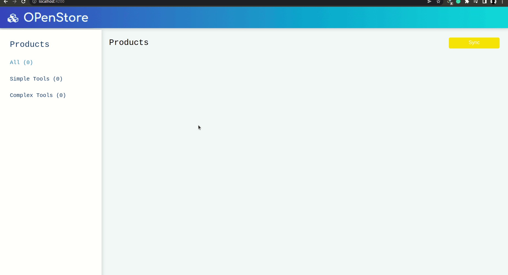

# OPenStore
this project has been made with Angular framework and without any CSS frameworks

## how it works
- when the page is opened the data get fetched from the local storage and when the yellow Sync button is pressed a request will be sent to get the data from the server and update the data in the local storage and also on the window

- when the blue sync is pressed only the data of that item will be updated

### `tip`
- when hitting https://captello.firebaseio.com/products/1.json it gets me the data of the item with `id = 2` and that also happens with all items, so I took a benefit of it to make sure that the data changes 

### gif
